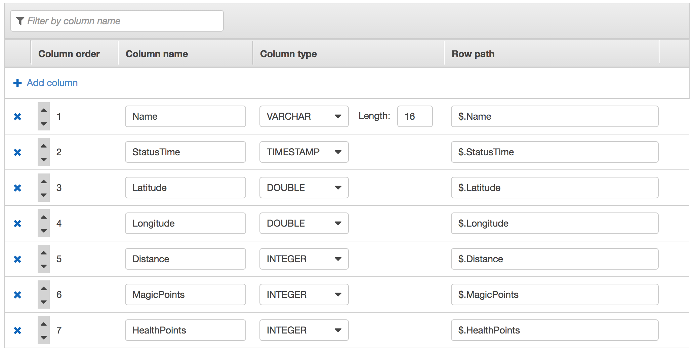

# 모듈 3: 스트리밍 집계 Streaming Aggregation

이번 모듈에서는 유니콘 함대의 센서 데이터를 실시간으로 집계하는 Amazon Kinesis Analytics 어플리케이션을 만들어봅니다. 응용 프로그램은 스트림에서 읽고, Wild Rydes에 있는 각 유니콘의 최소 총 이동 거리와 최소 이동량 및 최대 이동량을 계산하여 매분마다 Amazon Kinesis 스트림에 출력합니다.

## 아키텍쳐 개요

이 모듈의 아키텍쳐에는 Amazon Kinesis Analytics 애플리케이션, 소스(source) 및 대상(destination) Amazon Kinesis 스트림, 생산자(producer) 및 소비자(consumer) 커맨드 라인 클라이언트가 포함됩니다.

<kbd></kbd>

우리의 생산자(producer)는 유니콘(Shadowfax)에 연결된 센서로 현재 Wild Ryde에서 승객을 태우고 있습니다. 이 센서는 유니콘의 현재 위치, 1초 전의 이동 거리, 매직 포인트 및 히트 포인트를 포함하여 1초마다 데이터를 전송하므로 운영 팀이 Wild Rydes 본사에서 유니콘의 상태를 모니터링 할 수 있습니다.

Amazon Kinesis Analytics 애플리케이션은 이전 모듈에서 생선한 소스 Amazon Kinesis 스트림의 데이터를 처리하고 이를 분당(per-minute) 기준으로 집계합니다. 매분마다, 애플리케이션은 마지막 순간에 여행 한 총 거리와 함대의 각 유니콘에 대한 건강 및 매직 포인트의 최소 및 최대 값을 포함한 데이터를 방출합니다. 이러한 데이터 포인트는 시스템의 다른 구성요소에서 처리하기 위해 대상 Amazon Kinesis 스트림으로 전송됩니다.

모듈을 시작하기 전에 [클라이언트 설치 지침][client-installation]에 따라 Kinesis 커맨드 라인 클라이언트를 다운로드 했는지 확인하십시오.

## 구현 지침

### 1. Amazon Kinesis 스트림 만들기

Amazon Kinesis Streams 콘솔을 사용하여 이름은 **wildrydes-aggregated** 로 하고, shard는 **1** 로 설정한 새 스트림을 만듭니다 .

<details>
<summary><strong>단계별 지침 (자세한 내용을 보려면 펼쳐주세요)</strong></summary><p>

1. AWS Console 에서 **Services** 를 클릭한 다음 Analytics 섹션에서 **Kinesis** 를 선택하십시오.

1. **Go to Streams console**를 클릭하십시오.

1. **Create Kinesis stream**를 클릭하십시오.

1. **Kinesis stream name** 에 `wildrydes-aggregated` 를 입력하고, **Number of shards** 에는 `1` 을 입력한뒤, **Create Kinesis stream** 클릭하십시오.

1. 약 60 초 이내에 Kinesis 스트림이 **ACTIVE** 로 바뀌면서 실시간 스트리밍 데이터를 저장할 준비가 된 상태로 변경됩니다.

    <kbd></kbd>

</p></details>

### 2. Amazon Kinesis Analytics 애플리케이션 만들기

이전 모듈에서 빌드 된 **wildrydes** 스트림에서 읽은 Amazon Kinesis Analytics 애플리케이션을 빌드하고 매 분마다 다음 속성을 가진 JSON 객체를 내보냅니다.

- **Name**: Unicorn name (유니콘 이름)
- **StatusTime**: The ROWTIME provided by Amazon Kinesis Analytics (Amazon Kinesis Analytics 에서 제공하는 ROWTIME)
- **Distance**: The sum of distance traveled by the unicorn (유니콘이 여행 한 거리의 합계)
- **MinMagicPoints**: The minimum data point of the _MagicPoints_ attribute (_MagicPoints_ 속성의 최소 데이터 요소)
- **MaxMagicPoints**: The maximum data point of the _MagicPoints_ attribute (_MagicPoints_ 속성의 최대 데이터 요소)
- **MinHealthPoints**: The minimum data point of the _HealthPoints_ attribute (_HealthPoints_ 속성의 최소 데이터 요소)
- **MaxHealthPoints**: The maximum data point of the _HealthPoints_ attribute (_HealthPoints_ 속성의 최대 데이터 요소)

응용 프로그램의 대상 스트림을 **wildrydes-aggregated** 로 설정합니다.

<details>
<summary><strong>단계별 지침 (자세한 내용을 보려면 펼쳐주세요)</strong></summary><p>

1. 생산자(producer) 를 실행해서 센서 데이터를 스트림으로 내보내십시오. **YOUR\_REGION\_HERE** 를 여러분이 선택한 리전으로 설정하십시오. 예를 들어, 미국 서부 US West (Oregon) 에서 스트림을 만든 경우 us-west-2 로 바꾸면 됩니다.

	```console
	./producer -region YOUR_REGION_HERE
	```

	생산자(producer)는 스트림에 메시지를 두번 보낸뒤 화면에 마침표 `.` 를 출력합니다

	```console
	$ ./producer -region us-east-1
	..................................................
	```

	응용 프로그램을 구축하는 동안 센서 데이터를 활성화하면 Amazon Kinesis Analytics 에서 스키마를 자동으로 감지할 수 있습니다.

1. AWS Console 에서 **Services** 를 클릭한 다음 Analytics 섹션에서 **Kinesis** 를 선택하십시오.

1. **Go to the Analytics console** 클릭하십시오.

1. **Create application** 클릭하십시오.

1. **Application name** 에 `wildrydes` 를 입력하고 **Create application** 를 클릭하십시오.

1. **Connect to a source** 을 클릭하고, **wildrydes** 를 클릭하십시오.

	<kbd></kbd>

1. 화면 아래로 스크롤해서 **Discovery Schema** 버튼을 선택해주십시오. **Schema discovery successful** 메시지가 표시된 뒤, 스키마가 제대로 자동으로 발견(Schema discovery)됐는지 확인하십시오:

	<kbd></kbd>

1. **Edit schema** 을 클릭해서 스키마를 확인합니다:

	<kbd></kbd>

	자동 발견된 스키마의 데이터 유형이 위의 스크린샷과 일치하는지 확인하십시오. 그렇지 않은 경우, 데이터 유형을 조정하고 **Save schema and update stream samples** 를 클릭하십시오.

1. **Exit** 를 클릭하고 **Save and continue** 을 선택하십시오.

1. **Go to SQL editor** 을 클릭하십시오. 그러면 실시간 Amazon Kinesis 스트림 위에서 쿼리를 작성할 수 있는 대화형 쿼리 세션이 열립니다. promoted로 설정이 되면, **Yes, start application** 을 클릭하십시오.

1. 다음 SQL 쿼리를 복사해서 붙여넣습니다:

	```sql
	CREATE OR REPLACE STREAM "DESTINATION_SQL_STREAM" (
	  "Name"                VARCHAR(32),
	  "StatusTime"          TIMESTAMP,
	  "Distance"            SMALLINT,
	  "MinMagicPoints"      SMALLINT,
	  "MaxMagicPoints"      SMALLINT,
	  "MinHealthPoints"     SMALLINT,
	  "MaxHealthPoints"     SMALLINT
	);

	CREATE OR REPLACE PUMP "STREAM_PUMP" AS
	  INSERT INTO "DESTINATION_SQL_STREAM"
	    SELECT STREAM "Name", "ROWTIME", SUM("Distance"), MIN("MagicPoints"),
	                  MAX("MagicPoints"), MIN("HealthPoints"), MAX("HealthPoints")
	    FROM "SOURCE_SQL_STREAM_001"
	    GROUP BY FLOOR("SOURCE_SQL_STREAM_001"."ROWTIME" TO MINUTE), "Name";
	```

1. **Save and run SQL** 을 실행하십시오. 매분마다 집계된 데이터가 포함된 행(rows)이 표시됩니다. 처음 SQL 어플리케이션 작성시 30~90초 정도 기다리는 시간이 필요합니다.

	<kbd></kbd>
	
1. **exit (done)** 링크를 클릭하십시오.

1. **Destination** 메뉴에서 **Connect to a destination** 버튼을 선택하십시오.

	<kbd></kbd>

1. **wildrydes-aggregated** 라디오버튼을 선택해서 대상 스트림으로 설정하고 **Save and continue** 을 클릭하십시오.

</p></details>

## 구현한 내용 확인하기

1. 소비자(consumer)를 실행하여 집계된 스트림에서 센서 데이터를 읽기 시작합니다. **YOUR\_REGION\_HERE** 를 여러분이 선택한 리전으로 설정하십시오. 예를 들어, 미국 서부 US West (Oregon) 에서 스트림을 만든 경우 us-west-2 로 바꾸면 됩니다.

	```console
	./consumer -region YOUR_REGION_HERE -stream wildrydes-aggregated
	```

	소비자(consumer)는 매 분마다 애플리케이션에서 전송하는 집계된 데이터를 인쇄합니다:

	```json
	{
	    "Name": "Shadowfax",
	    "StatusTime": "2017-05-06 17:47:00.000",
	    "Distance": 9413,ㅇ
	    "MinMagicPoints": 153,
	    "MaxMagicPoints": 159,
	    "MinHealthPoints": 150,
	    "MaxHealthPoints": 157
	}
	{
	    "Name": "Shadowfax",
	    "StatusTime": "2017-05-06 17:48:00.000",
	    "Distance": 9407,
	    "MinMagicPoints": 144,
	    "MaxMagicPoints": 155,
	    "MinHealthPoints": 153,
	    "MaxHealthPoints": 157
	}
	```

1. 생산자(producer)로 실험하기:

	1. Control + C 를 키보드로 눌러서 생산자(producer)를 중지하고, 메시지가 중지되는지 확인하십시오.

	1. 생산자(producer) 다시 시작하고 메시지가 다시 나타나는지 확인하십시오.

	1. 다른 탭이나 콘솔에서 생산자(producer)의 다른 인스턴스를 시작하십시오. 특정 유니콘 이름을 제공하고 소비자(consumer)의 출력에서 두 유니콘의 데이터 요소를 확인합니다.

		```console
		./producer -region YOUR_REGION_HERE -name Bucephalus
		```

생산자(producer)의 실험이 끝나면, 다음 모듈로 이동할 수 있습니다: [스트림 처리 Stream Processing][stream-processing-module].

## 추가 도전 과제

- **wildrydes** 스트림에서 읽고 유니콘의 매직 포인트가 100 포인트 미만인 데이터 포인트를 선택하는 또 다른 Kinesis Analytics 애플리케이션을 빌드하십시오.

<!-- Build another Kinesis Analytics application which reads from the **wildrydes** stream and selects data points where a unicorn's magic points vital sign is below 100 points. -->

[stream-processing-module]: ../4_StreamProcessing/README.md
[client-installation]: ../README.md#kinesis-command-line-clients
