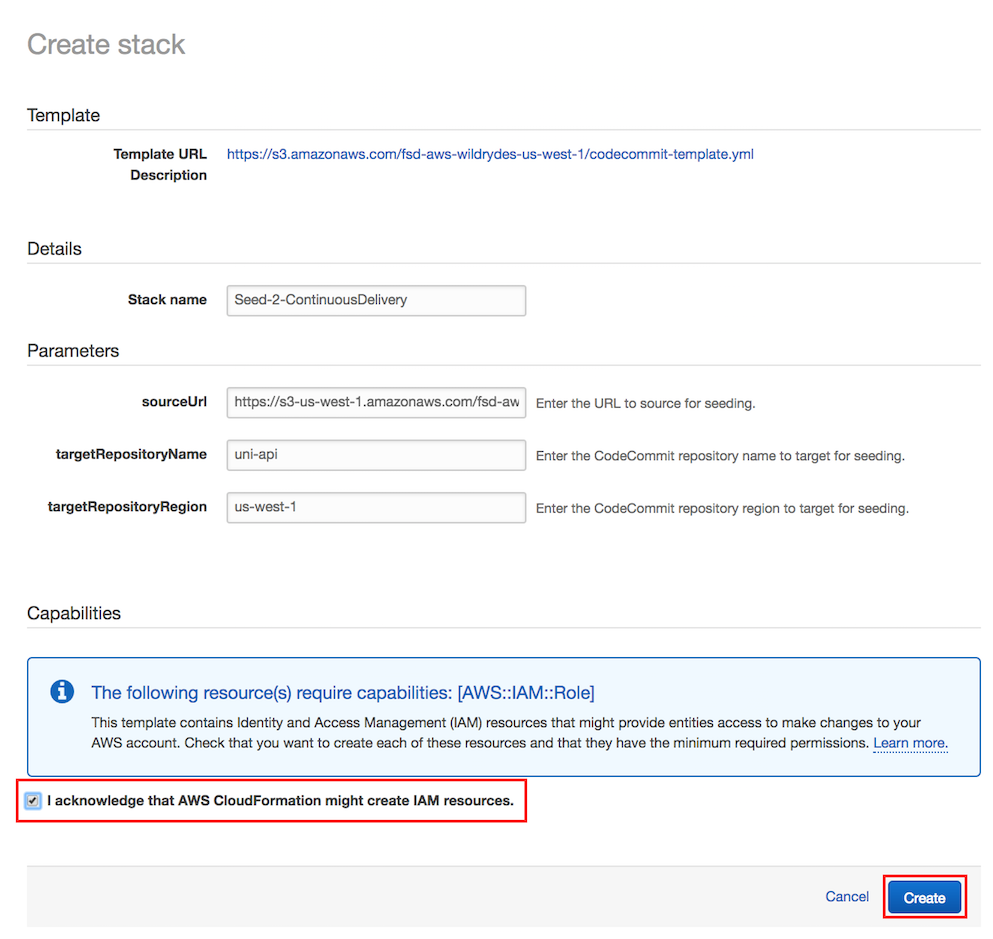
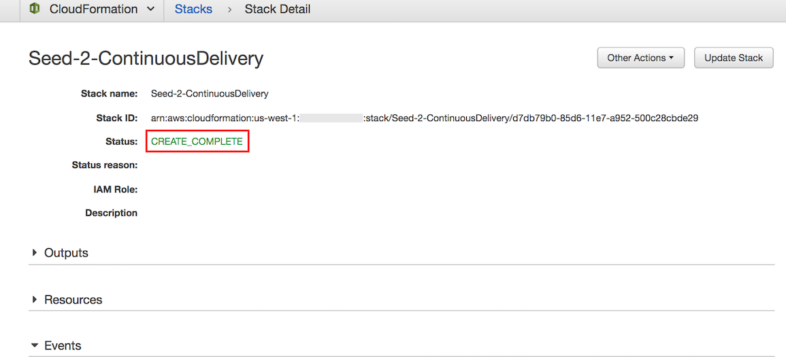
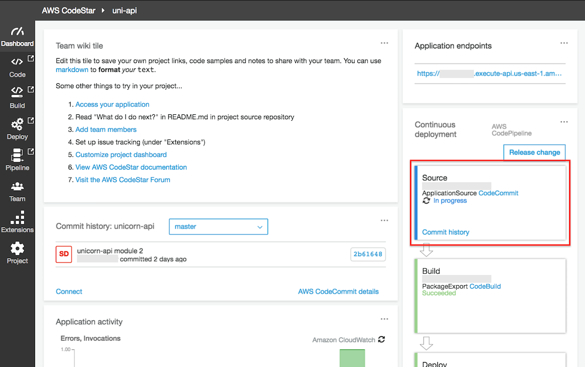
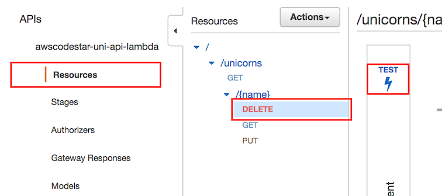
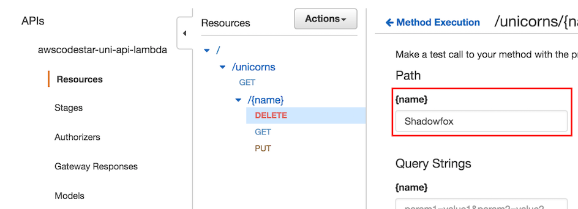

# 모듈 2: 지속적 통합 및 전달 파이프라인

이번 모듈에서는 [AWS CodePipeline](https://aws.amazon.com/codepipeline/), [AWS CodeBuild](https://aws.amazon.com/codebuild/), [Amazon S3](https://aws.amazon.com/s3/)를 이용하여 Unicon API를 자동적으로 배포를 하기 위한 지속적 통합 및 전달 파이프라인를 생성하도록 하겠습니다.

## CodePipeline 개요

CodePipeline는 코드 변경 사항에 대한 빌드, 테스트, 배포 단계를 관리 및 조율 합니다. 아래 사진은 이 모듈을 통해 생성할 CodePipeline의 최종 모습입니다.


## CodeBuild 개요

CodeBuild는 소스 코드를 컴파일 하여 테스트를 수행하고 배포 가능한 소프트웨어 패키지를 생성합니다.

Unicorn API [buildspec.yml](buildspec.yml) 파일에는 프로젝트 빌드에 필요한 명령어 및 결과물 생성에 필요한 명령어를 포함하고 있습니다.

```yaml
version: 0.1

phases:
  build:
    commands:
      - cd app && npm install
      - aws cloudformation package --template app-sam.yaml --s3-bucket $S3_BUCKET --output-template template-export.yml

artifacts:
  type: zip
  files:
    - template-export.yml
```

Unicorn API의 경우에는 빌드 명령어는 이전 모듈 [Serverless Application Model: Step 2](../1_ServerlessApplicationModel#2-package-the-uni-api-for-deployment)의 **CloudFormation package** 에서 사용하는 명령어와 동일 합니다. 단지, S3 버킷의 경우에만 CodeStar 프로젝트에서 설정한 외부 환경변수로 변경되었습니다.

이전 모듈에 사용한 **CloudFormation package** 명령어를 다시 한번 살펴 보면 로컬 소스 코드의 내용을 패키징, S3 업로한 후 S3 참조 주소가 CodeUri로 변경된 새로운 CloudFormation 템플레이트를 반환합니다.

Unicorn API의 경우 최종 결과물은 zip으로 암축되어 있으며 ``template-export.yml`` 파일만을 포함하고 있습니다.

## 구현 지침

본 모듈은 여러 섹션으로 구성되어 있으며 매 섹션 시작에는 개괄적인 개요가 준비되어 있습니다. 섹션 마다 구현을 위한 자세한 내용은 단계별 지침안에서 확인 하실 수 있으십니다. 이미 AWS Management Console에 익숙하시거나 둘러보기를 거치지 않고 직접 서비스를 탐색하시려는 분들을 위해 구현을 완료하는 데 필요한 충분한 내용을 각 섹션의 개요에서 제공하고 있습니다.

최신 버젼의 크롬, 파이어폭스, 사파리 웹 브라우저를 사용하신다면 단계별 지침을 클릭하셔서 자세한 내용을 확인하시기 바랍니다.

### 1. `uni-api` CodeCommit 깃 저장소 시작 하기

1. 각각의 모듈은 해당 워크숍 진행에 필요한 소스 코드와 CodeStar 및 CodeCommit 깃 저장소와 연동이 되어 있습니다. 깃 저장소를 시작하기 위해서는 여러분이 선택하신 리전의 **Launch Stack** 버튼을 클릭 하여 주시기 바랍니다.

    Region| Launch
    ------|-----
    US East (N. Virginia) | [](https://console.aws.amazon.com/cloudformation/home?region=us-east-1#/stacks/create/review?stackName=Seed-2-ContinuousDelivery&templateURL=https://s3.amazonaws.com/fsd-aws-wildrydes-us-east-1/codecommit-template.yml&param_sourceUrl=https://s3.amazonaws.com/fsd-aws-wildrydes-us-east-1/uni-api-2.zip&param_targetRepositoryName=uni-api&param_targetRepositoryRegion=us-east-1)
    US West (N. California) | [](https://console.aws.amazon.com/cloudformation/home?region=us-west-1#/stacks/create/review?stackName=Seed-2-ContinuousDelivery&templateURL=https://s3.amazonaws.com/fsd-aws-wildrydes-us-west-1/codecommit-template.yml&param_sourceUrl=https://s3-us-west-1.amazonaws.com/fsd-aws-wildrydes-us-west-1/uni-api-2.zip&param_targetRepositoryName=uni-api&param_targetRepositoryRegion=us-west-1)
    US West (Oregon) | [](https://console.aws.amazon.com/cloudformation/home?region=us-west-2#/stacks/create/review?stackName=Seed-2-ContinuousDelivery&templateURL=https://s3.amazonaws.com/fsd-aws-wildrydes-us-west-2/codecommit-template.yml&param_sourceUrl=https://s3-us-west-2.amazonaws.com/fsd-aws-wildrydes-us-west-2/uni-api-2.zip&param_targetRepositoryName=uni-api&param_targetRepositoryRegion=us-west-2)
    EU (Ireland) | [](https://console.aws.amazon.com/cloudformation/home?region=eu-west-1#/stacks/create/review?stackName=Seed-2-ContinuousDelivery&templateURL=https://s3.amazonaws.com/fsd-aws-wildrydes-eu-west-1/codecommit-template.yml&param_sourceUrl=https://s3-eu-west-1.amazonaws.com/fsd-aws-wildrydes-eu-west-1/uni-api-2.zip&param_targetRepositoryName=uni-api&param_targetRepositoryRegion=eu-west-1)
    EU (Frankfurt) | [](https://console.aws.amazon.com/cloudformation/home?region=eu-central-1#/stacks/create/review?stackName=Seed-2-ContinuousDelivery&templateURL=https://s3.amazonaws.com/fsd-aws-wildrydes-eu-central-1/codecommit-template.yml&param_sourceUrl=https://s3-eu-central-1.amazonaws.com/fsd-aws-wildrydes-eu-central-1/uni-api-2.zip&param_targetRepositoryName=uni-api&param_targetRepositoryRegion=eu-central-1)
    Asia Pacific (Sydney) | [](https://console.aws.amazon.com/cloudformation/home?region=ap-southeast-2#/stacks/create/review?stackName=Seed-2-ContinuousDelivery&templateURL=https://s3.amazonaws.com/fsd-aws-wildrydes-ap-southeast-2/codecommit-template.yml&param_sourceUrl=https://s3-ap-southeast-2.amazonaws.com/fsd-aws-wildrydes-ap-southeast-2/uni-api-2.zip&param_targetRepositoryName=uni-api&param_targetRepositoryRegion=ap-southeast-2)

1. CloudFormation 템플레이트는 이번 모듈을 진행하는데 있어서 필요한 항목들이 사전에 정의 되어 있습니다.

1. **I acknowledge that AWS CloudFormation might create IAM resources.** 체크 박스를 체크 하여 주시기 바랍니다. CloudFormation에 여러분을 대신하여 스택 생성에 필요한 IAM 자원을 생성 할 수 있도록 권한 부여를 허락함을 의미 합니다.

1. 브라우저창의 우측 하단의 **Create** 버튼을 클릭하여 주시기 바랍니다. 이번 모듈에 필요한 CloudFormation 스택을 생성 및 CodeCommit 저장소를 생성합니다.

    

1. 깃 저장소에 새로운 코드로 준비되기 까지는 약간의 지연이 발생 할 수 있습니다. 만약 모든 것이 성공적으로 생성이 되었다면 CloudFormation의 상태는 ``CREATE_COMPLETE`` 이어야 합니다.

    

### 2. CodeCommit 깃 저장소로 부터 Fetch 하기

새로운 코드가 추가된 CodeCommit 깃 저장소가 생성되었습니다. 코드를 수정 할 수 있도록 이 저장소의 변경사항을 여러분의 로컬 깃 저장소로 복사할 것 입니다. 일반적으로 리모트 깃 저장소의 업데이트된 내용은 `git pull` 명령어로 수행할 수 있습니다. 하지만 이번 워크숍에서는 저장소의 history가 새롭게 생성 되었기 때문에 `git pull`이 아닌 다른명령어를 사용 하셔야 합니다.

여러분이 사용하시 편한 깃 클라이언트를 이용해서 아래 명령어 들을 여러분의 로컬 **uni-api** 깃 저장소에서 실행해 주시기 바랍니다.

* `git fetch --all`
* `git reset --hard origin/master`

### 3. app-sam.yaml에 Delete 함수 추가 하기

텍스트 편집기를 이용하셔서 `app-sam.yaml` 파일을 열어 주시기 바랍니다. `DeleteFunction`의 이름으로 **AWS::Serverless::Function** 리소스를 추가 하시기 바랍니다. 아래는 해당 리소스의 정의를 추가 하시기

> 주의: YAML 파일에서는 공백이 매우 중요합니다. app-sam.yaml 파일의 CloudFormation Resources 규칙과 동일한 공백 규칙을 사용하시기 바랍니다.

1. **FunctionName**은 `uni-api-delete` 입니다.

1. **Runtime**은 `nodejs6.10` 입니다.

1. **CodeUri**는 `app` 입니다.

1. **Handler**는 `delete.lambda_handler` 입니다.

1. **Description**는 `Delete a Unicorn` 입니다.

1. **Timeout**는 `10` 입니다.

1. **Event** 타입은 `Api` 이며 **Path**를 `/unicorns/{name}` 와 연동하여 주시기 바랍니다. 그리고 **Method**는 `delete` 입니다.

1. **Environment** 변수 이름은 `TABLE_NAME` 값으로는 `Table` 자원의 참조 주소를 입력하여 주시기 바랍니다.

1. **Role**은 다른 함수와 같이 사용합니다.

``app-sam.yaml`` 추가할 코드의 문법을 아래 코드를 참조하셔서 공백 규칙 및 문법을 확인 하시기 바랍니다.

<details>
<summary><strong>app-sam.yaml에 Delete 함수 추가 하기 (자세한 내용을 보려면 펼쳐주세요)</strong></summary><p>

```yaml
  DeleteFunction:
    Type: 'AWS::Serverless::Function'
    Properties:
      FunctionName: 'uni-api-delete'
      Runtime: nodejs6.10
      CodeUri: app
      Handler: delete.lambda_handler
      Description: Delete Unicorn
      Timeout: 10
      Events:
        DELETE:
          Type: Api
          Properties:
            Path: /unicorns/{name}
            Method: delete
      Environment:
        Variables:
          TABLE_NAME: !Ref Table
      Role:
        Fn::ImportValue:
          !Join ['-', [!Ref 'ProjectId', !Ref 'AWS::Region', 'LambdaTrustRole']]
```

</p></details>

### 4. 변경 사항을 로컬 깃 레포지토리에 커밋 하기

1. 깃 클라이언트를 이용하여 로컬 변경 사항을 깃에 저장 하시고 커밋을 하시기 바랍니다. 예를 들면:

    ```bash
    git add .
    git commit -m "Add delete function"
    ```

1. 깃 클라이언트를 이용해서 업데이트 사항을 origin에 푸쉬 하시기 바랍니다. 예를 들면:

    ```bash
    git push origin
    ```

### 5. CodePipeline 유니콘 API 배포 검증

코드 변경사항을 CodeStar 프로젝의 CodeCommit 깃 저장소에 푸쉬를 하신뒤 여러분은 수정한 코드가 정상적으로 빌드가 되고 배포가 되는지 CodePiepline을 통해 확인 하도록 하겠습니다.

1. AWS Management 콘솔에서 **Services**를 선택한 다음 Developer Tools 섹션에서 **CodeStar** 를 선택하십시오.

1. `uni-api` 프로젝트를 선택 하십시오.

    

1. 웹 브라우저의 오른쪽 지속적 배포 파이프라인을 보시면 현재 Source 단계 창이 파란색(진행중)임을 확인 할 수 있습니다.

    

1. 각 단계의 창의 색갈은 실행중일때 파란색으로 바뀌고 완료가 되면 녹색으로 바뀝니다. 모든 단계를 성공적으로 마쳤다면 파이프 라인은 아래 화면과 같은 결과를 나타내야 합니다.

    

### 6. Delete API Method 테스트

1. AWS Management 콘솔에서 **Services**를 선택한 다음 Application Services 섹션에서 **API Gateway**를 선택하십시오.

1. 좌측 네비게이션에서 `awscodestar-uni-api-lambda`를 클릭하시기 바랍니다.

1. API resources 리스트에서 `/{name}` resource 아래 `DELETE` 를 클릭하시기 바랍니다.

1. Resource 상세 항목 패널에서 클라이언트 박스 좌측의 `TEST`를 클릭하시기 바랍니다.

    

1. 테스트 페이지에서 **Path** 항목에 `Shadowfox`를 입력하시기 바랍니다.

    

1. 화면을 아래로 스크롤 하신 다음 **Test** 버튼을 클릭하시기 바랍니다.

1. 화면을 테스트 페이지의 맨 위로 올리신 다음, 패널의 오른쪽의 **Status** 코드에서 HTTP 응답이 200임을 확인 하시기 바랍니다.

    

1. AWS Management 콘솔에서 **Services**를 선택한 다음 Developer Tools 섹션에서 **CodeStar** 를 선택하십시오.

1. `uni-api` 프로젝트를 선택 하십시오.

    

1. 상황판 오른쪽에 있는 **Application endpoints** 창에서 URL 주소를 복사하십시오.

    

1. 웹 브라우저에서 방금 복사한 URL을 붙여넣기 한뒤 주소에 `/unicorns` 를 추가해 주시기 바랍니다. 아래 주소와 같은 형식이 되어야 합니다. `https://xxxxxxxxxx.execute-api.us-east-1.amazonaws.com/Prod/unicorns/`

1. 웹 브라우저에서는 유니콘 리스트에 `Shadowfox`가 삭제된 JSON 결과를 보여 주어야 합니다.

## 완료

축하합니다! 여러분은 유니콘 API의 자동 배포를 위한 지속적 통합 및 전달 파이프라인을 AWS의 CodePipeline을 이용하셔 생성하셨습니다. 다음 모듈에서는 [X-Ray Module](../3_XRay) AWS X-Ray를 통합하여 어떻게 유니콘 API의 버그를 해결하는지 실습을 해보도록 하겠습니다.
